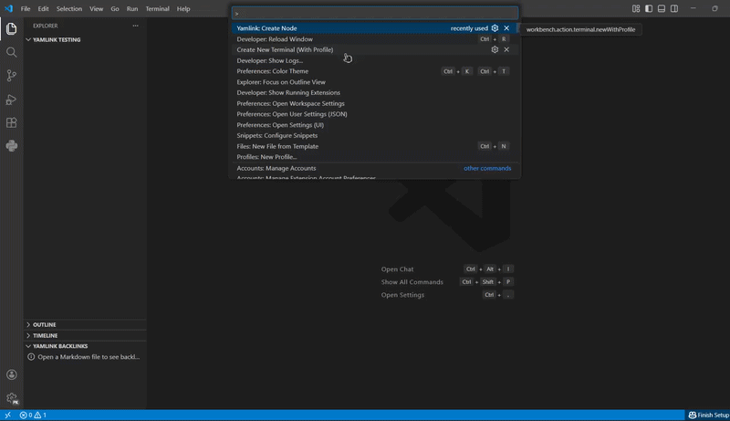

<p align="center">  </p> <h1 align="center">Yamlink</h1> <p align="center"> <strong>Structured systems built on Markdown.</strong><br> Identity lives in your frontmatter, not your filenames. </p> <p align="center">    </p>

---



---
[](https://marketplace.visualstudio.com/items?itemName=yamlink.yamlink)
---

Yamlink turns Markdown vaults into **structured knowledge systems**.

Instead of relying on filenames as identity, each Markdown file declares a canonical `id:` in YAML frontmatter. That identity becomes the permanent node of your vault — linkable, navigable, and rename-safe.

Use Yamlink to build:

- Personal knowledge bases
- Research databases and literature maps
- CRM-style relationship graphs
- Project and architecture knowledge systems
- Documentation knowledge graphs
- World-building and narrative systems

All local-first. All Git-native.

---

## The Problem

Most Markdown linking systems rely on filenames. Over time, files are renamed, reorganized, and moved. Links drift and references break. A vault slowly becomes a loose collection of documents rather than a coherent system.

Yamlink separates **identity** from **filenames**.

---

## The Core Idea

Every node declares its identity in YAML frontmatter:

```yaml
---
id: concept-recursion
type: concept
created: 2025-01-15
---
A function that calls itself. The base case prevents infinite descent.
```

Once a file has an `id:`:

- It becomes linkable from anywhere via `[[concept-recursion]]`
- Ctrl+Click navigates directly to it
- The filename is cosmetic — rename it freely, nothing breaks
- Changing the `id:` triggers controlled, vault-wide propagation with your explicit approval

The type system is entirely yours. Use `type: character`, `type: paper`, `type: service`, `type: decision` — Yamlink observes what you define and builds intelligence from it.

---

## Rename Propagation

Yamlink treats identity change as a structural event — not an accident.

When you change an `id:` and save, Yamlink:

1. Scans the entire vault for references to the old ID
2. Shows you exactly how many files are affected
3. Asks for confirmation before applying anything
4. Lets you preview large changes before committing
5. Offers a one-click revert if you change your mind

**References are never silently broken.**

---

## What's in Apollo (0.1.0)

|Feature|Description|
|---|---|
|Canonical `id:` identity|Filename is cosmetic. The `id:` field is permanent.|
|Vault-wide rename propagation|Change an ID, update every reference — with confirmation.|
|Hybrid graph model|YAML typed relations + body wikilinks, both tracked.|
|Backlinks panel|Explorer sidebar panel showing every inbound link with its field label.|
|Wikilink autocomplete|`[[` triggers suggestions from every indexed node.|
|Ctrl+Click navigation|Jump to any node instantly.|
|Hover preview|Frontmatter fields + body snippet on hover.|
|Real-time diagnostics|Broken links, duplicate IDs, unknown types — surfaced as you type.|
|Quick fixes|Create a node from a broken link. Add frontmatter to any file.|
|Observational type registry|Types are derived from your vault — nothing hardcoded.|
|Status bar|Live node count and broken link indicator at the bottom of VS Code.|
|Strict ID validation|Letters, numbers, hyphens, underscores only. Enforced at creation.|

---

## Backlinks Panel

The Backlinks panel in the Explorer sidebar shows every inbound link to the active file, labeled by how it was declared.

YAML field relations show their field name:

```
elara-voss        protagonist
the-shattered-fen location
act-two           appears-in
```

Body wikilinks are labeled `body`:

```
chapter-04        body
research-notes    body
```

Click any entry to open that file directly.

---

## Getting Started

**1. Open a folder in VS Code.**

**2. Create your first node.**

Run `Yamlink: Create Node` from the Command Palette (`Ctrl+Shift+P`).

- Enter an ID — letters, numbers, hyphens, underscores only
- Select a type from your vault, or define a new one
- The file is created and opened immediately

```yaml
---
id: elara-voss
type: character
created: 2025-01-15
---
```

**3. Start linking.**

Type `[[` anywhere in a Markdown file to trigger autocomplete. Select any indexed node.

```markdown
The market district was [[elara-voss]]'s territory long before the guild took notice.
```

**4. Build structure.**

Declare typed relations directly in frontmatter to make connections explicit:

```yaml
---
id: chapter-04
type: chapter
protagonist: [[elara-voss]]
location: [[the-shattered-fen]]
created: 2025-01-15
---
```

Open `elara-voss.md` — the Backlinks panel now shows `chapter-04` labeled `protagonist`.

Every domain works the same way. Swap `character` and `chapter` for `service` and `decision`, or `paper` and `concept`, or anything else your work demands.

---

## ID Rules

**Valid:**

```
elara-voss
concept_recursion
decision-2025-01-15
```

**Invalid:**

```
Elara Voss       ← spaces not allowed
note#1           ← special characters not allowed
```

The filename is cosmetic. The `id:` is the permanent, canonical identity of the node.

**Field names follow the same rule.** Use hyphens, not spaces: `related-concepts` not `related concepts`. Fields with spaces are not recognized as graph edges.

---

## Diagnostics

Yamlink surfaces structural issues in real time — no separate lint step needed.

|Code|Severity|Meaning|
|---|---|---|
|`yamlink.missingId`|Hint|File has no `id:` and is not indexed|
|`yamlink.duplicateId`|Warning|Same `id:` declared in multiple files|
|`yamlink.brokenLink`|Warning|Body wikilink references a non-existent node|
|`yamlink.brokenRelation`|Warning|YAML relation references a non-existent node|
|`yamlink.unknownType`|Info|`type:` value not seen in any other node (vaults of 10+ nodes)|

All diagnostics are non-destructive. Every warning has a Quick Fix.

---

## Philosophy

- **Local-first** — your vault is a folder of plain Markdown files
- **Git-native** — every node, every relation, every change is version-controlled
- **Schema-optional** — structure emerges from your vault; nothing is enforced until you want it
- **No proprietary storage** — disable the extension and your files are still valid Markdown
- **No cloud dependency** — nothing leaves your machine

The extension adds structure, not lock-in.

---

## Roadmap

**Phase 2 — Intelligence Layer** _(in progress)_

- Schema enforcement — declare required fields per type
- Field suggestions based on type — YAML autocomplete guided by schema
- Supertag equivalent — `type: character` suggests all character fields *not confirmed*

**Phase 3 — Query Surface**

- Query blocks — live rendered tables inside Markdown *not confirmed*
- Vault health report — clickable status bar opens a full report: nodes by type, broken links, orphans, total word count
- Graph visualization — D3.js webview of the full node graph
- Orphan detection — nodes with no connections surfaced automatically

**Phase 4 — Views + Export**

- Type-filtered sidebar views
- Kanban view for nodes with `status:` field
- Export pipeline — PDF, HTML, structured JSON

**Phase 5 — Platform**

- Web companion for read-only vault viewing
- API layer for programmatic vault queries
- Team vaults — shared graph, merge-safe via Git

---

## Version

**0.1.0 — Apollo**

Identity engine. Hybrid graph. Backlinks panel. Real-time diagnostics.

---

<p align="center"> Files first, always. </p>
